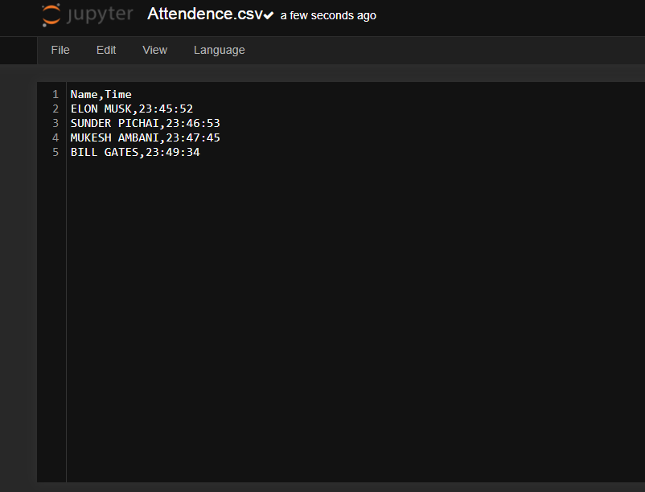

# Smart-Attendance-Management-System-Using-Face-Recognition

This project is capable of processing live video-stream of students entering their classroom and generate the list of students attending the class with exact time and date.

  
<h3>Motivation Behind The Project</h3>

As we all know online teaching is a great step in this covid era. We saves a lot of time by attending and deleivering lectures from home over the internet. But still, 
maintaining the attendance record is a challenging task. The conventional method of calling name of each student, time gap between muting and unmuting mike and marking attendance in register or updating in a excel sheet is time consuming and there is always a chance of proxy attendance. Thus to overcome this I designed this model.

<h3>Other Useful Application</h3>

Mobile Face Unlock System. 

Finding missing person name from the face-list generated from roadside CCTVs.

Spotting VIPS during cricket matches.

<h3>Example</h3>

